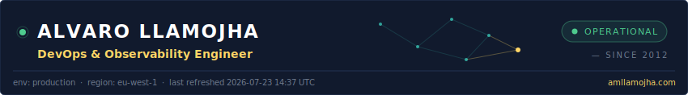
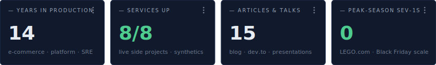
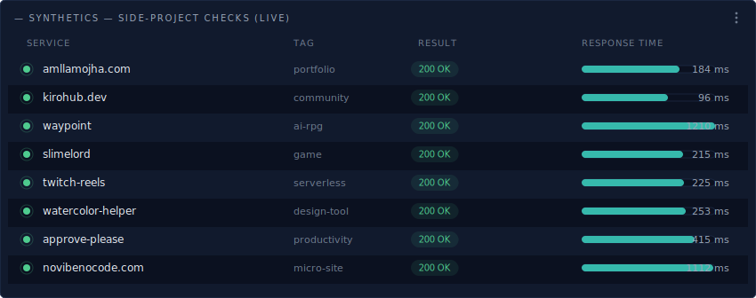
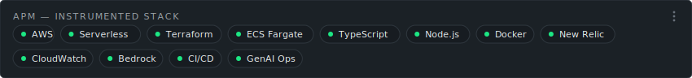
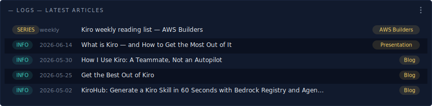
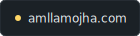
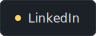
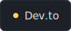
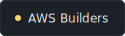
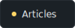

<!--
  This profile is a live New Relic-style dashboard.
  The SVG widgets in assets/ are generated by scripts/generate-dashboard.mjs,
  refreshed on a schedule by .github/workflows/refresh-dashboard.yml:
    - Synthetics widget: real HTTP checks (status + latency) against my side projects
    - Logs widget: latest articles pulled from amllamojha.com
-->

&nbsp;
&nbsp;
&nbsp;
&nbsp;

<strong>▸ Trace details — more about me</strong>

 

- **Now** — Observability, platform & DevOps consultant at **No Limits Solutions**: New Relic rollouts, monitoring & alerting foundations, and AWS/serverless support for GenAI start-ups.
- **Before** — Senior AWS DevOps & Serverless Engineer at **LEGO.com**: first serverless microservices (Node.js/TypeScript), Terraform-driven migration to ECS Fargate, and zero high-severity incidents through peak seasons. Earlier: DevOps at **SecretSales** (Docker, CloudFormation, New Relic, PagerDuty).
- **Also** — AWS Solutions Architect Associate. I write about observability, deployment patterns, and AI-assisted development (Kiro, Bedrock, agents) — and ship [side projects](https://amllamojha.com) for fun.

